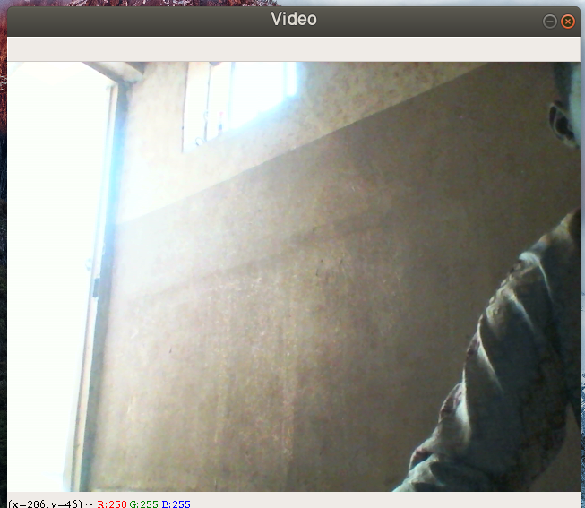

OpenCV provides a video capture object which handles everything related to opening and closing of the webcam.\
I will create that object and keep reading frames from it.

The code will open the webcam, capture the frames, and then display them in a window.

### Running the app
    python webcam.py

prees the escape key (esc) to close the window